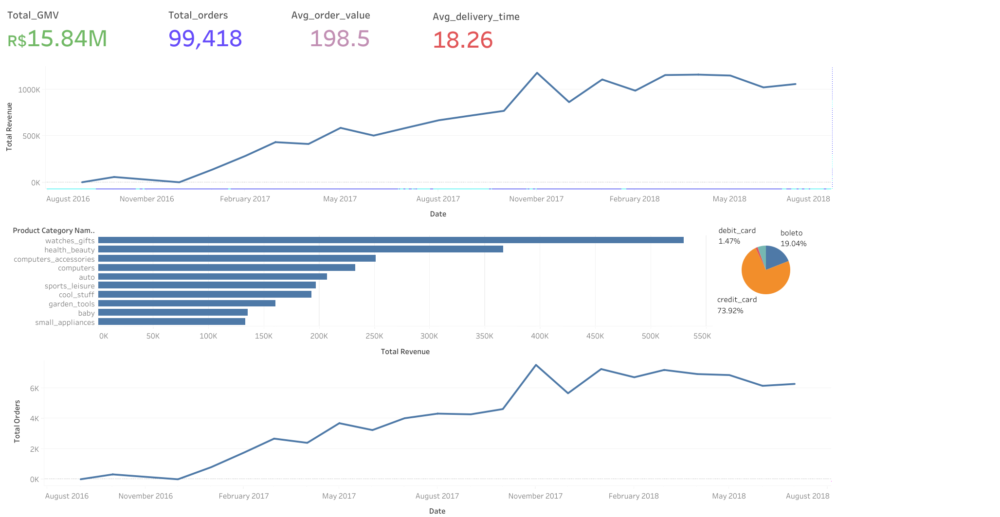
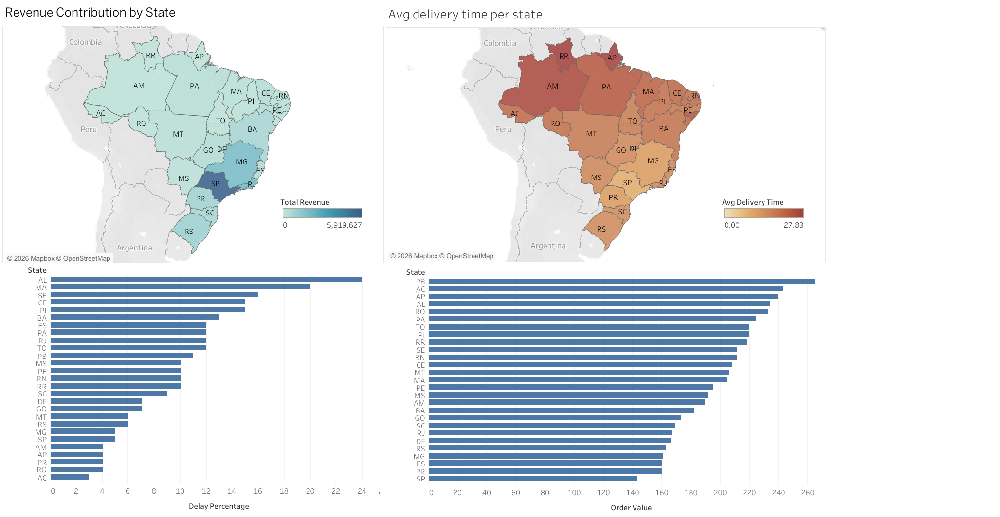
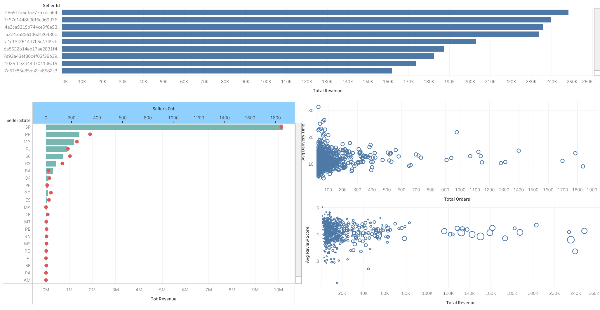
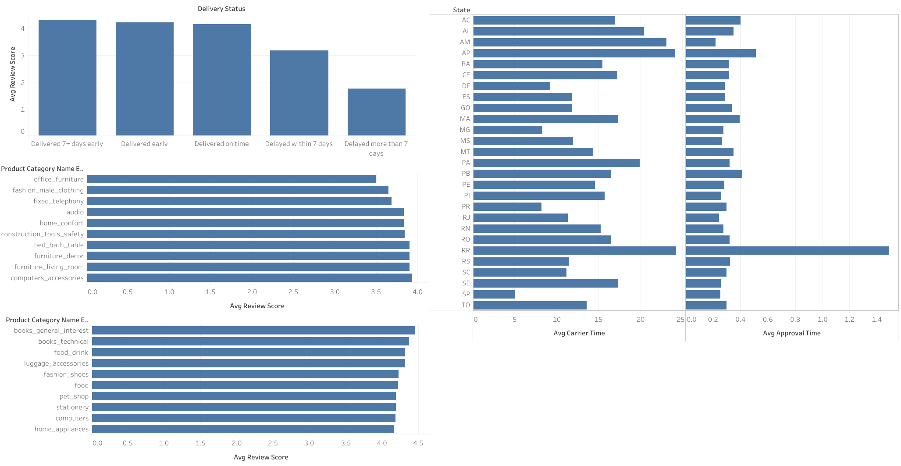

# Olist E-Commerce Analytics

An end-to-end data analytics project on Brazil's largest e-commerce
platform using 100K+ real transactions across 8 relational tables.

**Tools:** Python · PostgreSQL · Tableau  
**Dataset:** [Olist Brazilian E-Commerce - Kaggle](https://www.kaggle.com/datasets/olistbr/brazilian-ecommerce)  
**Dashboard:** [View Live on Tableau Public](https://public.tableau.com/app/profile/mohula.prasath.b/viz/OlistE-CommerceExecutiveSummary/Dashboard1)

---

## Project Structure

- `notebooks/01_preprocessing.ipynb` — Data cleaning across 8 tables,
  feature engineering (delivery time, approval time, carrier time,
  product volume, expected vs actual delivery)
- `notebooks/02_eda.ipynb` — Exploratory analysis across 6 sections:
  orders, customers, items, products, reviews, sellers, payments
- `sql/` — 20 analytical queries: revenue KPIs, delivery performance,
  seller rankings, payment analysis, review quality scoring
- `dashboard/` — 4-page interactive Tableau dashboard

---

## Key Business Findings

1. **São Paulo alone drives 37.4% of total GMV** — contributing
   R$5.92M out of R$15.84M platform revenue, yet has the lowest
   average delivery time at just 8.3 days, confirming that seller
   concentration in SP directly enables faster, higher-volume commerce

2. **Northern states face a severe logistics gap** — Roraima (RR) and
   Amapá (AP) average 27.8 days delivery, more than 3× slower than
   SP's 8.3 days. RR carries a 10% late delivery rate driven by the
   longest seller approval times nationally

3. **Alagoas (AL) has the highest late delivery rate at 24%** —
   nearly 1 in 4 orders arrives late despite low order volumes,
   indicating a structural logistics failure not a scale problem

4. **Credit cards dominate at 73.9%** — with an average of 3.6
   installments per transaction vs 1.0 for boleto, debit and voucher
   users, indicating strong customer preference for spreading payments
   on larger purchases

5. **November 2017 GMV spiked 53.3%** — from R$769K to R$1.18M
   month-on-month driven by Black Friday, making it the single
   highest revenue month in the dataset. The platform sustained
   elevated demand through Q1 2018 at R$1.1M+ per month

6. **Late delivery collapses review scores by 60%** — orders delayed
   more than 7 days averaged just 1.74 stars (out of 5) vs 4.32 for
   orders delivered 7+ days early — a 60% drop in customer
   satisfaction. Even a delay within 7 days drops scores to 3.18,
   confirming delivery speed is the single strongest driver of
   customer experience on the platform

---

## Dashboard Preview

### Page 1 — Executive Summary


### Page 2 — Geographic Analysis


### Page 3 — Seller Performance


### Page 4 — Delivery & Review Quality


---

## How to Run

**Python notebooks:**
```bash
pip install pandas numpy matplotlib seaborn
jupyter notebook
```

**SQL queries:**
- Load processed CSVs into PostgreSQL using pgAdmin import tool
- Run files in `sql/` folder in numbered order
- All queries tested on PostgreSQL 15+

**Data source:**
Download raw CSVs from
[Kaggle](https://www.kaggle.com/datasets/olistbr/brazilian-ecommerce)
and place in `data/raw/`